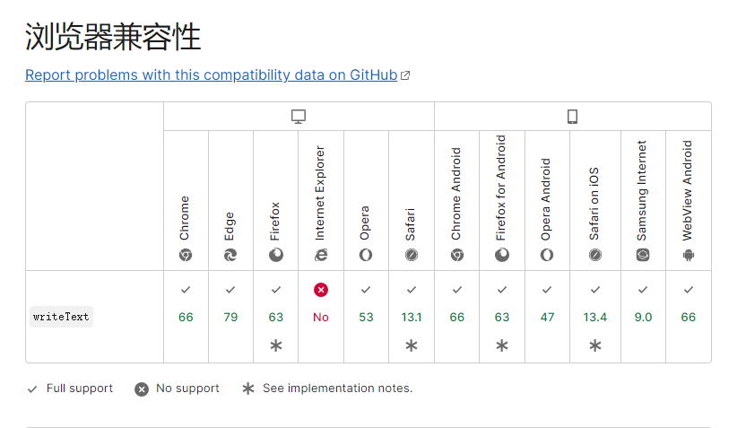

## 方法一 document.execCommand

```javascript
let oInput = document.createElement('input');
oInput.value = value;
document.body.appendChild(oInput);
oInput.select(); // 选择对象;
document.execCommand("Copy"); // 执行浏览器复制命令
this.$Message.success('复制成功');
oInput.remove()
```
> 该方法已废弃，[参考文档](https://developer.mozilla.org/zh-CN/docs/Web/API/Document/execCommand)  

这个 API 本来也不是标准 API，而是一个 IE 的私有 API，在 IE9 时被引入，后续的若干年里陆续被 Chrome / Firefix / Opera 等浏览器也做了兼容支持，但始终没有形成标准。

这个 API 被废弃的主要原因第一个就是安全问题，在用户未经授权的情况下就可以执行一些敏感操作，这就很恐怖了；第二个问题是因为这是一个同步方法，而且操作了 DOM 对象，会阻塞页面渲染和脚本执行，因当初还没 Promise，所以没设计成异步，挖坑了。

------

## 方法二 Clipboard.writeText()

```javascript
navigator.clipboard.writeText(value).then(() => {
  this.$Message.success('复制成功');
});
```

> 基于promise [参考文档](https://developer.mozilla.org/zh-CN/docs/Web/API/Clipboard/writeText)  


