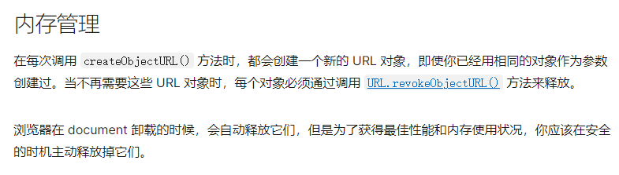

线上示例：[https://codesandbox.io/s/wen-jian-lei-xing-zhuan-huan-xds3mv](https://codesandbox.io/s/wen-jian-lei-xing-zhuan-huan-xds3mv)

## File

### isFile: 判断File类型

```javascript
function isFile(file) {
    return Object.prototype.toString.call(file) === '[object File]'
}
```

### isFile: 判断File类型
> 该方法与Blob => Base64 一样

```javascript
function FileToBase64(file) {
    return new Promise((resolve, reject) => {
        const fileReader = new FileReader()
        fileReader.onload = (e) => {
            resolve(e.target.result)
        }
        fileReader.onerror = () => {
            reject(new Error('FileToBase64 error'))
        }
        fileReader.readAsDataURL(file)
    });
}
```

### File => Blob

```javascript
function FileToBlob(file) {
    return new Blob([file], { type: file.type })
}
```

## Base64

### Base64 => File
> ios11.4以下的系统，new File存在兼容问题，待验证

```javascript
function Base64ToFile(base64, filename = 'file'){
    const arr = base64.split(',')  //去掉base64格式图片的头部
    const mime = arr[0].match(/:(.*);/)[1]
    const suffix = mime.split('/')[1]
    const bstr = atob(arr[1])   //atob()方法将数据解码
    let len = bstr.length
    const u8arr = new Uint8Array(len)
    while(len--){
        u8arr[len] =  bstr.charCodeAt(len) //返回指定位置的字符的 Unicode 编码
    }
    return new File([u8arr], `${filename}.${suffix}`, {type:mime}) 
}
 
Base64ToFile('<base64>','testImg')
```

<p style="color:red">❌ 该方法利用file => blob验证后图片无效</p>

```javascript
function Base64ToFile(base64, filename = 'file'){
    const arr = base64.split(',')  //去掉base64格式图片的头部
    const mime = arr[0].match(/:(.*);/)[1]
    const suffix = mime.split('/')[1]
    const bstr = atob(arr[1])   //atob()方法将数据解码
    return new File([bstr], `${filename}.${suffix}`, {type: mime }) 
}
 
 Base64ToFile('<base64>','testImg')
```

### Base64 => Blob

```javascript
function Base64ToBlob(base64) {
    const arr = base64.split(',')
    const mime = arr[0].match(/:(.*?);/)[1]
    const bstr = atob(arr[1])
    let n = bstr.length, u8arr = new Uint8Array(n)
    while (n--) {
        u8arr[n] = bstr.charCodeAt(n);
    }
    return new Blob([u8arr], { type: mime })
}
```

## Blob

### Blob => blobURL
> 借助 `URL.createObjectURL` 能力将blob对象创建一个本地的内存地址链接，可供预览使用
> 该方法一般配合 URL.revokeObjectURL 使用，释放当前内存地址
> 但释放后该链接就打不开了，释放时机视具体场景而定
> [URL.createObjectURL() - Web API 接口参考 | MDN](https://developer.mozilla.org/zh-CN/docs/Web/API/URL/createObjectURL#%E5%86%85%E5%AD%98%E7%AE%A1%E7%90%86)
> 

```javascript
function BlobToBlobURL(blob) {
    return URL.createObjectURL(blob)
}
```

### Blob => File

```javascript
function BlobToFile(blob, filename = 'file') {
    const { type } = blob
    const suffix = type.split("/")[1]
    return new File([blob], `${filename}.${suffix}`, { type });
}
```

> 因 new File 存在兼容性问题，可使用该方法处理

```javascript
function BlobToFile(blob, filename = 'file') {
    blob.lastModifiedDate = new Date();
    const suffix = blob.type.split("/")[1]
    blob.name = `${filename}.${suffix}`;
    return blob;
}
```

### Blob => Base64

```javascript
function BlobToBase64(blob) {
    return new Promise((resolve, reject) => {
        const fileReader = new FileReader()
        fileReader.onload = (e) => {
            resolve(e.target.result)
        }
        fileReader.onerror = () => {
            reject(new Error('BlobToBase64 error'))
        }
        fileReader.readAsDataURL(blob)
    });
}
```

### Blob => ArrayBuffer

```javascript
function BlobToArrayBuffer(blob) {
    return new Promise((resolve, reject) => {
        const reader = new FileReader()
        reader.onload = function() {
            resolve(this.result)
        }
        reader.onerror = function() {
            reject(new Error('BlobToArrayBuffer error'))
        }
        reader.readAsArrayBuffer(blob)
    })
}
```

## URL

### URL => Base64

**该转换仅适用图片**

转换原理：URL --> img --> Canvas --> canvas.toDataURL --> Base64

> 由于Canvas无法对跨域的图片进行操作，所以必须开启允许跨域，除了当前执行canvas前开启跨域（img.crossOrigin = 'Anonymous'）外，服务端也必须开启允许跨域

```javascript
function URLToBase64(url,callback){
    return new Promise((resolve, reject) => {
        const canvas = document.createElement('canvas')
        context = canvas.getContext('2d')
        img = new Image  //通过构造函数绘制图片实例
        img.crossOrigin = 'Anonymous'  //处理图片跨域问题
        img.onload = function() {   //该加载过程为异步事件，请先确保获取完整图片
            canvas.width = img.width
            canvas.height = img.height
            context.drawImage(img,0,0)  //将图片绘制在canvas中
            const URLData = canvas.toDataURL('image/png')
            resolve(URLData)
            canvas = null
        }
        img.onerror = function() {
            reject(new Error('URLToBase64 error'))
        }
        img.src = url
    })
}
```

### URL => Blob

转换原理：利用请求头设置 `responseType = 'blob'` 将url文件下载下来

```javascript
function URLToBlob(url) {
    return new Promise((resolve, reject) => {
        const xhr = new XMLHttpRequest()
        xhr.open('get', url, true)
        xhr.responseType = 'blob'
        xhr.onload = function () {
          resolve(this.response)
        }
        xhr.onerror = function () {
          reject()
        }
        xhr.send()
    })
}
```

## ArrayBuffer

### ArrayBuffer => Blob

```javascript
function ArrayBufferToBlob(arrayBuffer, type) {
    return new Blob([arrayBuffer], { type })
}
```