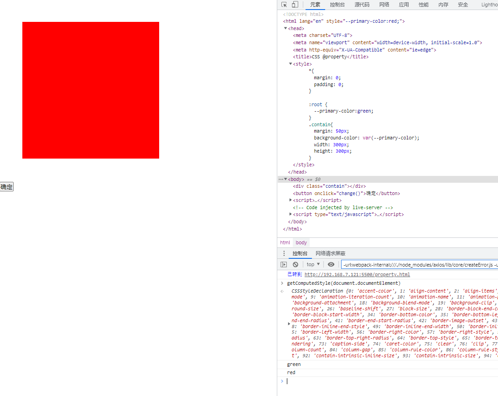

## 代码示例

```html
<!DOCTYPE html>
<html lang="en">
<head>
  <meta charset="UTF-8">
  <meta name="viewport" content="width=device-width, initial-scale=1.0">
  <meta http-equiv="X-UA-Compatible" content="ie=edge">
  <title>CSS @property</title>
  <style>
    *{
      margin: 0;
      padding: 0;
    }

    :root {
      --primary-color:green;
    }
    .contain{
      margin: 50px;
      background-color: var(--primary-color);
      width: 300px;
      height: 300px;
    }
  </style>
</head>
<body>
  <div class="contain"></div>
  <button onclick="change()">确定</button>
  <script>
    function change() {
      let html = document.documentElement
      // 获取根元素所有样式
      let root = getComputedStyle(html)
      // 获取根元素css变量
      let css = root.getPropertyValue('--primary-color').trim()
      console.log(css);

      // 设置css变量
      html.style.setProperty('--primary-color', 'red')
    }
  </script>
</body>
</html>
```

## 实际效果


## getComputedStyle()
用于获取指定元素的 CSS 样式。  
获取的样式是元素在浏览器中最终渲染效果的样式。

## getPropertyValue()
返回指定的 CSS 属性的值。