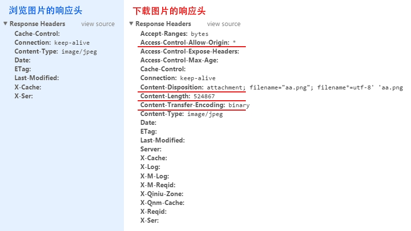
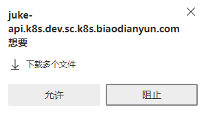

## 图片下载能力

### 服务端下载



关键属性：`Content-Disposition: attachment; filename="文件名.扩展后缀"`   
通过修改响应头，就可实现直接弹出下载提示

### 客户端下载

- iframe下载，限制太多，主要为了兼容ie，不推荐
- a标签的download属性
  - 但是该属性有同源限制，非同源就是个常规的跳转 [\<a> - HTML（超文本标记语言） | MDN](https://developer.mozilla.org/zh-CN/docs/Web/HTML/Element/a#attr-download)
  - 虽然有同源限制，但MDN告诉了我们解决方案：使用[blob: URL](https://developer.mozilla.org/zh-CN/docs/Web/API/URL/createObjectURL) 和 [data: URL](https://developer.mozilla.org/zh-CN/docs/Web/HTTP/Basics_of_HTTP/Data_URLs)
  - 当前场景需要的是将 url 图片链接下载到本地，就需要知道 url 如何转换为 blob 或 base64。需要了解文件间的[类型转换 ](#/learn/20221008_2)
- 可实现多图同时下载，但会受浏览器机制限制，需要获得用户授权，否则只能保存第一张（chrome）

  


```javascript
function getFileLinkName(url) {
  if (isEmpty(url)) return ''
  const s = url.split('?')[0].split('/')
  const last = s[s.length - 1]
  return last.indexOf('.') === -1 ? '' : last
}

export const useDownloadImage = () => {
  const handleDownload = (src, filename) => {
    const $a = document.createElement('a')
    $a.setAttribute('href', window.URL.createObjectURL(src))
    $a.setAttribute('download', filename)
    $a.click()
  }

  function xhrequest(url) {
    return new Promise((resolve, reject) => {
      const xhr = new XMLHttpRequest()
      xhr.open('get', url, true)
      xhr.responseType = 'blob'
      xhr.onload = function () {
        resolve(this.response)
      }
      xhr.onerror = function () {
        reject()
      }
      xhr.send()
    })
  }

  const downloadImages = (urls) => {
    console.log('downloadImages', urls)
    if (isEmpty(urls)) return
    if (typeof urls === 'string') {
      urls = [urls]
    }
    urls.forEach(async (item) => {
      const blobData = await xhrequest(item)
      const filename = getFileLinkName(item)
      if (filename) {
        handleDownload(blobData, getFileLinkName(item))
      }
    })
  }
  return {
    downloadImages,
  }
}
```