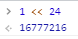

## 位运算符

> 在底层对数字（32 个数位）进行操作

```javascript
// 随机生成颜色值
generateColor() {
  return '#' + (~~(Math.random() * (1 << 24))).toString(16)
}
```
### 分解说明

1. `(1 << 24)`  
`<<`运算符：左移运算，代表数字中的所有数位向左移动指定的数量。  
因为位运算符是在数字底层（即表示数字的 32 个数位）进行操作，如下图：

- 数字1在二进制中，表示为（缺位补0）：`0000 0000 0000 0000 0000 0000 0000 0001`
- `1 << 24`表示数位向左移动24位：`0000 0001 0000 0000 0000 0000 0000 0000` 

最后得到的结果为：16777216  


> 颜色值#000000到#FFFFFF能记录数的个数为16的6次方个，即：16777216个。  
> 十六进制的000000代表十进制的0，FFFFFF代表十进制的16777215。


2. `~~(Math.random() * (1 << 24))`
向下取整取随机数，最大不超过16777215，等价于Math.floor(Math.random() * (1 << 24))  
~位运算符：位运算 NOT，实质上是对数字求负，然后减 1。
- 如数字5二进制为：`0000 0000 0000 0000 0000 0000 0000 0101`
- 转化为反码：`1111 1111 1111 1111 1111 1111 1111 1010`
- 反码首位即为符号位，0位正数，1为负数，由于是负数，需要进行二次取反：`0000 0000 0000 0000 0000 0000 0000 0101`
- 然后负数减1，得到：`0000 0000 0000 0000 0000 0000 0000 0110`
- 带上负数符号，转化为十进制为：-6

**以上运算过程等价于：`-5 - 1`，双`~~`运算符，代表进行了两次以上运算过程。**

> `~`位运算符不仅可以进行取反运算、取整运算，还可以将String类型的数组转化为Number类型。


------

## 一元运算符

**作用：**

将String类型数字转化为Number；

```javascript
let price = (+el.supply_price + +el.change_price).toFixed(2)
```

**一元加法：**
- 一元加法本质上对数字无任何影响，但会把字符串转换成数字。
- 一元加法运算符等价于parseInt()方法和Number()方法。
- 只对以 "0x" 开头的字符串（十六进制数）才能把它转换成十进制的值。

```javascript
let a = '-99.8'；
let b = '100'；
let c = 'xxxxx';
console.log(+a)  // 输出 number类型 -99.8
console.log(+b)  // 输出 number类型 100
console.log(+c)  // 输出 NaN
```
