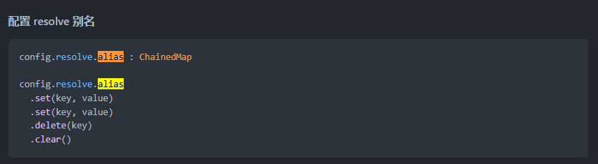

> 来自牛逼的杠二
## 如何修改配置
### 用如何配置别名alias举例

**1. webpack配置方式**

```javascript
// webpack.config.js
module.export = {
  resolve: {
    alias: {
      '@': path.resolve(__dirname, 'src'),
      '@utils': path.resolve(__dirname, 'src/utils')
    }
  }
}
```

**2. 使用vue-cli3以上版本，对繁杂的webpack配置进行了整合，需要在vue.config.js里配置，除了文档说明的字段外，其他配置项只能通过configureWebpack 或 chainWebpack 进行扩展**
> 扩展：了解[webpack-chain](https://github.com/neutrinojs/webpack-chain)链式操作[【中文文档】](https://github.com/Yatoo2018/webpack-chain/tree/zh-cmn-Hans)  
> 基本使用方式：需要配置哪一项，就在文档里搜索哪一项，比如配置alias，找到对应的搜索结果



```javascript
module.export = {
  chainWebpack: config => {
    // 批量添加alias，vue-cli内置有的有@和vue$
    config.resolve.alias.merge({
      '@': path.resolve(__dirname, 'src'),
      '@utils': path.resolve(__dirname, 'src/utils')
    })
    // 单个添加，不会覆盖默认alias
    config.resolve.alias.set('@utils', path.resolve(__dirname, 'src/utils'))
  }
}
```

**3. 使用vue-cli-plugin-\* 方式，`vue add resolve-alias` ，本质还是上面的实现原理，只是做了一层封装，方便配置**

```javascript
module.export = {
  pluginOptions: { // 通过vue add方式添加的plugin都在这个属性里配置
    'resolve-alias': {
      alias: {
        '@': resolve('src'), // 可以不用写，通过这种方式是单个添加，vue-cli默认配置过
        '@utils': path.resolve(__dirname, 'src/assets/utils')
      }
    },
  }
}
```
### 审查最终的webpack配置[【链接】](https://cli.vuejs.org/zh/guide/webpack.html#%E5%AE%A1%E6%9F%A5%E9%A1%B9%E7%9B%AE%E7%9A%84-webpack-%E9%85%8D%E7%BD%AE)

如何调试vue.config.js生成的webpack配置  
`vue inspect > output.js` 输出output.js文件查看具体配置是否生效


------

## 配置同步
### 添加alias
```javascript
// 安装vue-cli-plugin-resolve-alias: vue add resolve-alias
{
  pluginOptions: {
    'resolve-alias': {
      alias: {
        '@utils': path.resolve(__dirname, './src/assets/utils'),
        'videojs': 'video.js', // 不配置会编译报错https://github.com/surmon-china/vue-video-player/issues/211
      }
    }
  }
}
```

### 修改生产环境构建的文件名
```javascript
{
  chainWebpack: config => {
    config.output.filename('static/js/[name].[chunkhash:8].js');
    config.output.chunkFilename('static/js/chunk-[id].[chunkhash:8].js');
  }
}
```
### 修改静态文件域名
```javascript
{
  publicPath: 'https://www.xxxxxx.com/xxxx/xxxx'
}
```
### 配置SCSS全局变量
参考vue-cli[文档](https://cli.vuejs.org/zh/guide/css.html#%E8%87%AA%E5%8A%A8%E5%8C%96%E5%AF%BC%E5%85%A5)
```javascript
// 安装vue-cli-plugin-resolve-alias: vue add resolve-alias
{
  pluginOptions: {
    'style-resources-loader': {
      preProcessor: 'scss',
      patterns: [
        path.resolve(__dirname, './src/assets/styles/variables.scss')
      ]
    }
  }
}
```

### 配置postcss
vue-cli5默认已经引入了`postcss-autoprefixer`，其他`postcss-import`、`postcss-url` 当前项目没有用到

### 开启gzip
- 了解 https://webpack.js.org/plugins/compression-webpack-plugin
- 使用vue-cli-plugin-*方式，安装 vue add compression
- 配置差异性：
  - 旧版配置方式：https://github.com/webpack-contrib/compression-webpack-plugin/tree/v1.1.12
  - test => include
  - asset => filename

```javascript
{
  pluginOptions: {
    compression: {
      gzip: {
        algorithm: 'gzip',
        include: /\.(js|css|html|svg|json)(\?.*)?$/i,
        threshold: 10240,
      }
    }
  }
}
```

### 独立拆包
> 减少跟业务无关、不会变动的包的更新  
> 需要了解 webpack 的 SplitChunksPlugin https://webpack.docschina.org/plugins/split-chunks-plugin
- element-ui独立拆包
- echarts独立拆包

```javascript
{
  chainWebpack: config => {
    config.optimization.splitChunks({
      chunks: 'all',
      cacheGroups: {
        libs: {
          name: 'chunk-libs',
          test: /[\\/]node_modules[\\/]/,
          priority: 10,
          chunks: 'initial' // 只打包初始时依赖的第三方
        },
        elementUI: {
          name: 'chunk-elementUI', // 单独将 elementUI 拆包
          priority: 20, // 权重要大于 libs 和 app 不然会被打包进 libs 或者 app
          test: /element-ui/
        },
        charts: {
          name: 'chunk-charts',
          priority: 20,
          test: /charts/,
        },
        // vue: { // 测试发现完全没有必要拆，各种小的文件包都会被统一打包到chunk-lib里
        //   name: 'chunk-vue',
        //   priority: 20,
        //   test: /[\\/]node_modules[\\/](vue|vuex|vue-router|)[\\/]/
        // },
        commons: {
          name: 'chunk-commons',
          test: path.resolve(__dirname, 'src/components/common'), // 全局组件分包
          minChunks: 3, // 最小公用次数
          priority: 5,
          reuseExistingChunk: true
        }
      }
    })
  }
}
```

### 开发环境注入全局配置变量
```javascript
{
  chainWebpack: config => {
    if (process.env.NODE_ENV === 'development') {
      config.plugins.delete('html') // 需要删除默认的html配置
      config.plugin('HtmlWebpackPlugin').use(HtmlWebpackPlugin, [{
        templateContent(){
          const {PARAMS} = require('./dev.config.js')
          const config = Object.keys(PARAMS).reduce((r,key) =>{
            let val = PARAMS[key]
            try{
              val = PARAMS[key].replace(/'|"/g, ``)
            }catch(er){
              // er
            }
            return ({...r, [key]: val})
          }, {})
          let tpl = `<!DOCTYPE html>
            <html>
              <head>
                <meta charset="utf-8">
                <meta name="renderer" content="webkit" />
                <meta name="viewport" content="width=device-width,initial-scale=1.0">
                <title>{$param.name}</title>
                <link rel="icon" href="https://www.xxxxxxx.com/xxxxx/20210702/1625223354382.jpg" />
                <script>window.PARAMS = {$config}</script>
              </head>
              <body>
                <div id="app"></div>
              </body>
            </html>
          `
          tpl = tpl.replace(`{$param.name}`, config.name)
          tpl = tpl.replace(`{$config}`, JSON.stringify(config))
          return  tpl
        }
      }])
    }
  }
}
```

### 优化编译
使用cache功能，提升编译效率，[【参考文档】](https://webpack.js.org/configuration/cache)
```javascript
{
  chainWebpack: config => {
    config.cache({
      type: 'filesystem',
      cacheDirectory: path.resolve(__dirname, '.cache'),
    })
  },
}
```

### 添加分析工具
vue-cli-service已内置，直接在package.json添加scripts即可`"build:report": "vue-cli-service build --report"`

### 升级SCSS
修改 `/deep/`、`>>>` 修改组件内样式的写法
- 使用IDE全局搜索、正则匹配 `/deep/ => ::v-deep`、`>>> => ::v-deep` 进行批量替换
- ::v-deep 与选择器间需要有空格，搜索deep(\s)是否跟 v-deep 结果一致
- 升级后的scss不建议使用斜杠/作为分隔符，因为跟css现有的属性冲突，会出现一些报错[【原文】](https://sass-lang.com/documentation/breaking-changes/slash-div)