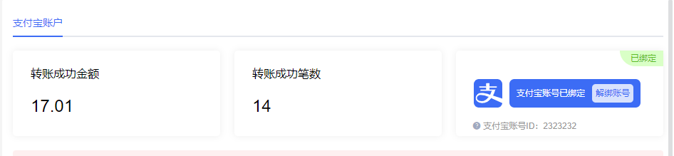
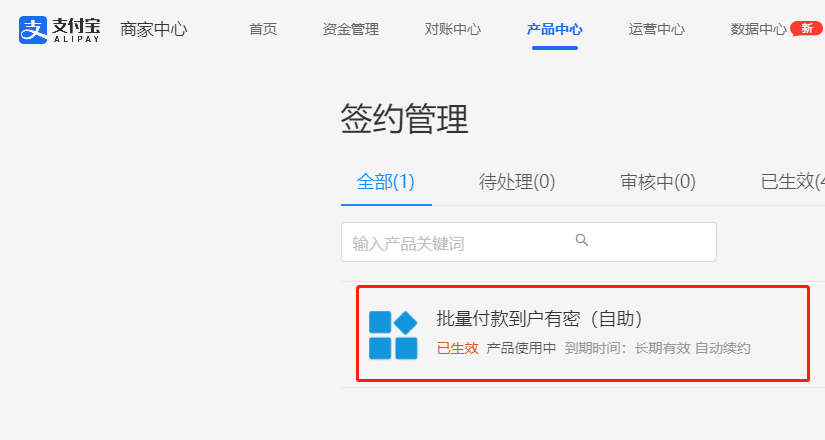

## 页面可见性判断

> 适用场景：需要新打开页面操作，原页面需要更新数据时。

- 绑定支付宝账号时，需要新打开三方页面，跳转到支付宝侧进行账号绑定操作。
- 绑定完成后，状态需要同步更新。
- 回到页面后，判断页面进入前台，更新支付宝状态，这样可以在不使用接口轮询或F5刷新页面即可更新状态，提升用户体验。





- document.hidden属性：Boolean类型，表示页面是否处于隐藏状态。页面隐藏包括页面在后台标签页或者浏览器最小化。**一般情况下，使用document.hidden就可以满足需求。**
- 而document.visibilityState相对详细一些，目前有四个可能的值：
  - visibble：页面部分内容可见。意味着该标签页是一个非最小化的可见标签页，可能被别的页面覆盖了一部分。
  - hidden:页面内容不可见。意味着该页面是后台标签页或者最小化，或者系统是锁屏状态等。
  - prerender:网页内容被预渲染并且用户不可见。
  - unloaded:如果文档被卸载，将返回这个值。
- visibilitychange事件：当文档的可见性改变时触发。

```javascript
// 标签页是否显示
pageVisiblity() {
  let isHidden = document.hidden
  if (!isHidden) {
    this.getAlipayStatus()
  }
},
created() {
  document.addEventListener('visibilitychange', this.pageVisiblity)
}
```

------

## 事件监听与卸载

> 如果要在`created`或`mounted`方法中定义，需要在`beforeDestroy`方法中将其删除。

进入页面时，需要监听页面可见性判断的事件，离开时卸载，避免二次进入后，多次触发。

```javascript
// bad code
created() {
  document.addEventListener('visibilitychange', this.pageVisiblity)
},
beforeDestroy() {
  document.removeEventListener('visibilitychange', this.pageVisiblity)
}


// goods code
document.addEventListener('visibilitychange', this.pageVisiblity)
this.$once('hook:beforeDestroy', () => {
  document.removeEventListener('visibilitychange', this.pageVisiblity)
})
```

应该将监听`visibilitychange`事件与销毁`visibilitychange`事件放到一起。某些情况下，两个事件中间可能会间隔几十行代码，可读性比较差。   
通过hook监听组件销毁钩子函数，并取消监听事件。