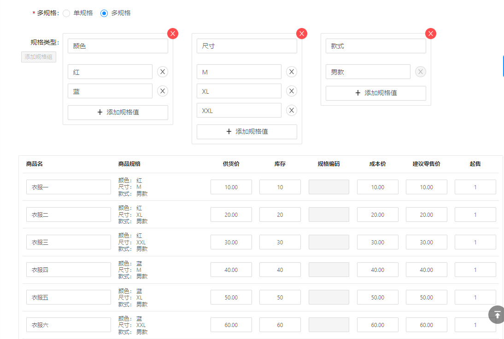
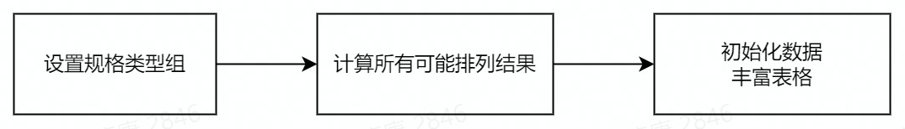
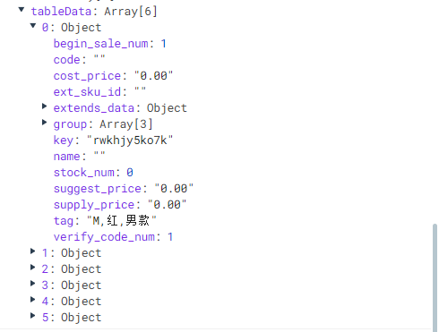
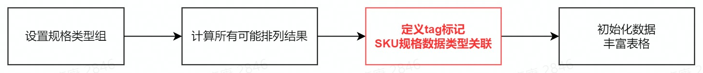
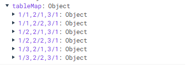
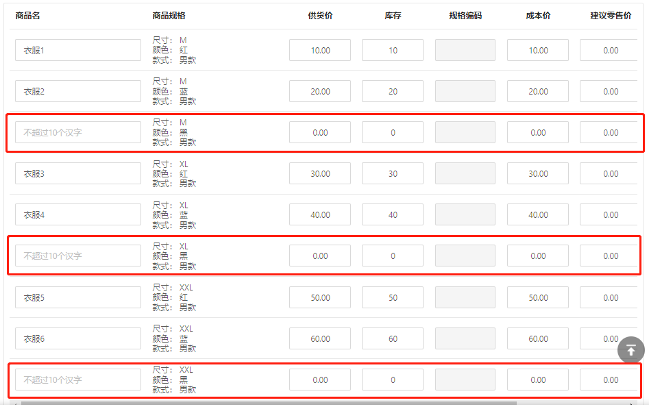
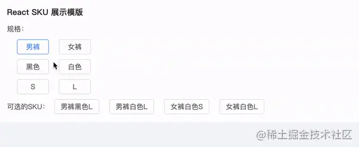

## 1. 数据生成流程



**规格类型数据：**

```json
// JSON
[
  {
    "key": 1,
    "name": "尺寸",
    "labels": [
      { "key": 1, "value": "M" },
      { "key": 2, "value": "XL" },
      { "key": 3, "value": "XXL" }
    ]
  },
  {
    "key": 2,
    "name": "颜色",
    "labels": [
      { "key": 1, "value": "红" },
      { "key": 2, "value": "蓝" },
    ]
  },
  {
    "key": 3,
    "name": "款式",
    "labels": [
      { "key": 1, "value": "男款" }
    ]
  }
]
```

## 2. 计算全排列组合的所有可能的结果：

```js
function calc(transArr) {
  let resultArr = [];
  function get(array, index, val) {
    if (!array[index]) {
      resultArr.push(val);
      return;
    }
    array[index].forEach((v, i) => {
      get(array, index + 1, index === 0 ? [v] : [...val, v])
    })
  }
  get(transArr, 0);
  return resultArr;
}
// 输出
// [
//   ["M","红","男款"],
//   ["M","蓝","男款"],
//   ["XL","红","男款"],
//   ["XL","蓝","男款"],
//   ["XXL","红","男款"],
//   ["XXL","蓝","男款"]
// ]
```

**初始化为可用的列表数据：**



## 3. 可能出现的问题

规格类型发生变动，会重新排列规格组合结果，然后初始化一次列表数据，之前填充的数据会被清空，交互体验差。  

友商参照：[荟集云 - 荟集科技](https://oc.huijicloud.com/)

### 解决方法



**(1). 定义tag标记，生成所有排列结果：**

```json
[
  ["1/1:M","2/1:红","3/1:男款"],
  ["1/1:M","2/2:蓝","3/1:男款"],
  ["1/2:XL","2/1:红","3/1:男款"],
  ["1/2:XL","2/2:蓝","3/1:男款"],
  ["1/3:XXL","2/1:红","3/1:男款"],
  ["1/3:XXL","2/2:蓝","3/1:男款"]
]
```

**(2). 组合tag值，生成Map类型数据保存，使该条SKU数据唯一：**

```js
let tableMap = list.reduce((res, item, index) => {
  res[item.tag] = item
  return res
}, {})
```



**(3). 初始化表格数据时，优先查找Map类型数据，找到即取出与之合并，反之即为新数据：**

> 添加一个【颜色：黑】的规格值，按序排列。



## 未来可能要做的



**参考文章**
- [电商最小存货 - SKU 和 算法实现 - 掘金](https://juejin.cn/post/7002746459456176158)
- [商品SKU功能设计与优化 - 掘金](https://juejin.cn/post/6844904080008036365)